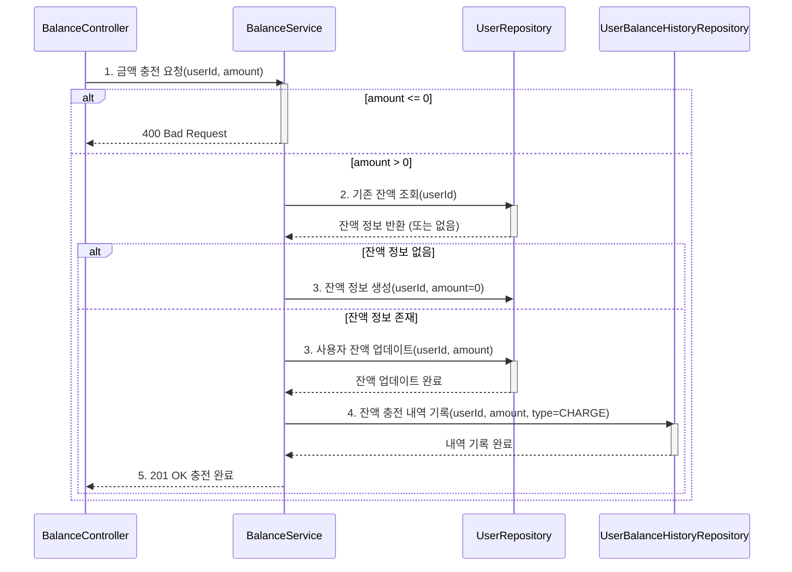

### 잔액 충전

```mermaid
sequenceDiagram
    participant BalanceController
    participant BalanceService
    participant UserRepository
    participant UserBalanceHistoryRepository


    BalanceController->>BalanceService: 1. 금액 충전 요청(userId, amount)
  activate BalanceService
    
   alt amount <= 0
        BalanceService-->>BalanceController: 400 Bad Request
        deactivate BalanceService
   else amount > 0
        BalanceService->>UserRepository: 2. 기존 잔액 조회(userId)
        activate UserRepository
				UserRepository-->>BalanceService: 잔액 정보 반환 (또는 없음)
				deactivate UserRepository
				
        alt 잔액 정보 없음
            BalanceService->>UserRepository: 3. 잔액 정보 생성(userId, amount=0)
        
         else 잔액 정보 존재
                BalanceService->>UserRepository: 3. 사용자 잔액 업데이트(userId, amount)
                activate UserRepository
                UserRepository-->>BalanceService: 잔액 업데이트 완료
                deactivate UserRepository
                
                BalanceService->>UserBalanceHistoryRepository: 4. 잔액 충전 내역 기록(userId, amount, type=CHARGE)
                activate UserBalanceHistoryRepository
                UserBalanceHistoryRepository-->>BalanceService: 내역 기록 완료
                deactivate UserBalanceHistoryRepository
                
                BalanceService-->>BalanceController: 5. 201 OK 충전 완료
        
        end
     end


```