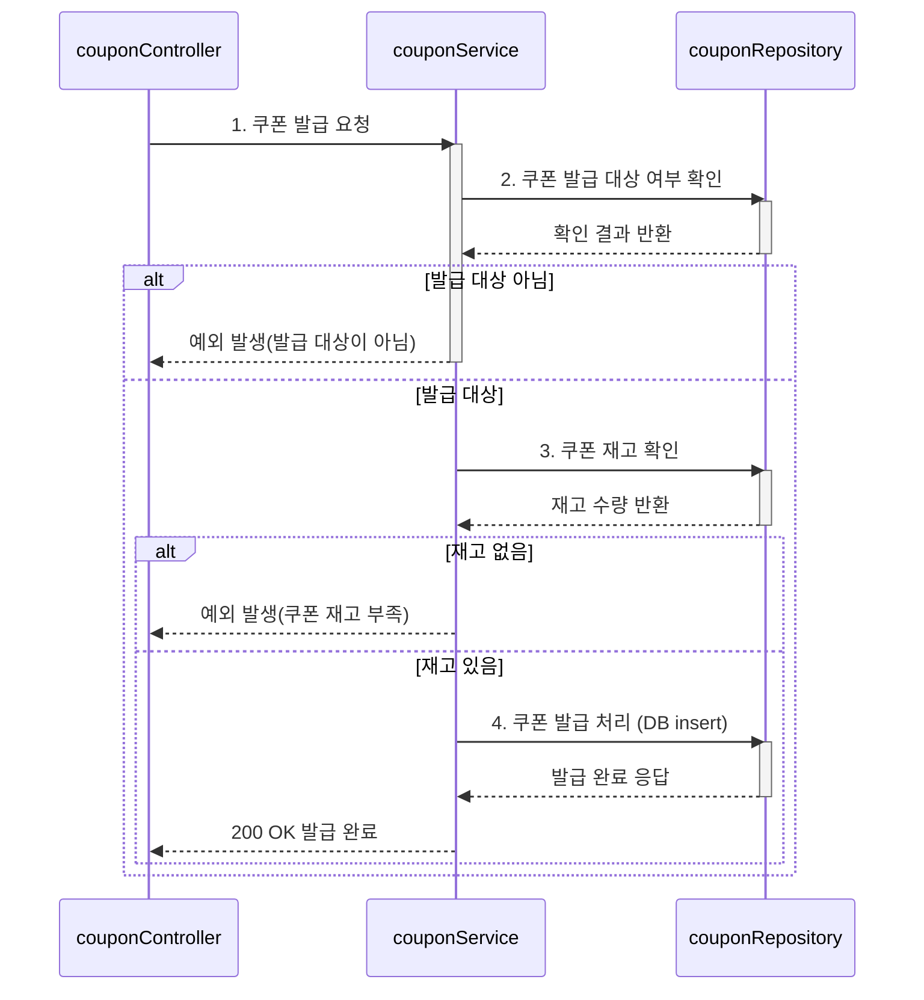

### 쿠폰 발급

```mermaid
sequenceDiagram
    participant couponController
    participant couponService
    participant couponRepository

 couponController->>couponService: 1. 쿠폰 발급 요청
    activate couponService
	    couponService->>couponRepository: 2. 쿠폰 발급 대상 여부 확인
	    activate couponRepository
	    couponRepository-->>couponService : 확인 결과 반환
	    deactivate couponRepository
	    
       alt 발급 대상 아님 
       couponService -->>couponController: 예외 발생(발급 대상이 아님)
	   deactivate couponService
       else 발급 대상
       couponService->>couponRepository: 3. 쿠폰 재고 확인
         activate couponRepository
        couponRepository-->>couponService: 재고 수량 반환
        deactivate couponRepository

     alt 재고 없음
	      couponService-->>couponController: 예외 발생(쿠폰 재고 부족)
	   else 재고 있음
          couponService->>couponRepository: 4. 쿠폰 발급 처리 (DB insert)
            activate couponRepository
            couponRepository-->>couponService: 발급 완료 응답
            deactivate couponRepository
        couponService-->>couponController: 200 OK 발급 완료
    end
end

```