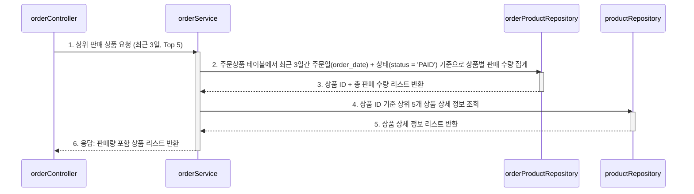

### 상위 상품 조회 API

```mermaid
sequenceDiagram
    participant orderController
    participant orderService
    participant orderProductRepository
    participant productRepository

    orderController->>orderService: 1. 상위 판매 상품 요청 (최근 3일, Top 5)
    activate orderService

    orderService->>orderProductRepository: 2. 주문상품 테이블에서 최근 3일간 주문일(order_date) + 상태(status = 'PAID') 기준으로 상품별 판매 수량 집계
    activate orderProductRepository
    orderProductRepository-->>orderService: 3. 상품 ID + 총 판매 수량 리스트 반환
    deactivate orderProductRepository

    orderService->>productRepository: 4. 상품 ID 기준 상위 5개 상품 상세 정보 조회
    activate productRepository
    productRepository-->>orderService: 5. 상품 상세 정보 리스트 반환
    deactivate productRepository

    orderService-->>orderController: 6. 응답: 판매량 포함 상품 리스트 반환
    deactivate orderService
```