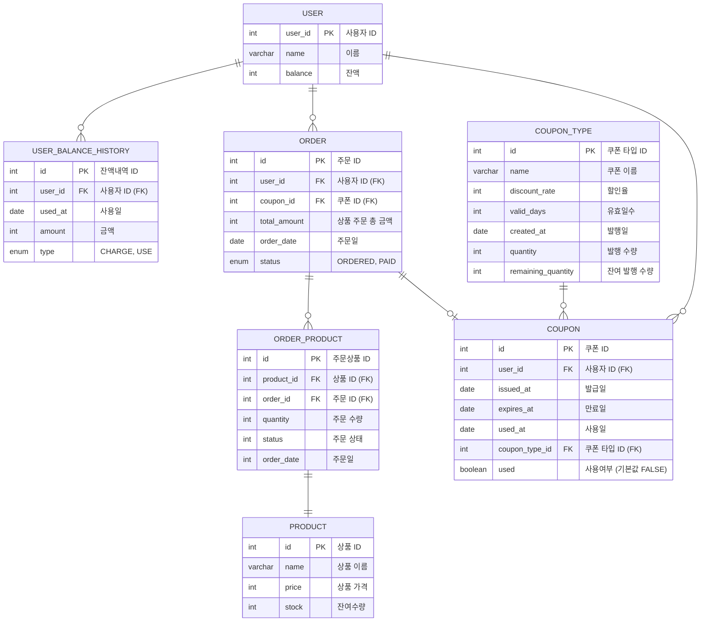

### ERD

```mermaid
erDiagram
    USER ||--o{ USER_BALANCE_HISTORY : ""
    USER ||--o{ ORDER : ""
    USER ||--o{ COUPON : ""
    ORDER ||--o{ ORDER_PRODUCT : ""
    ORDER ||--o| COUPON : ""
    ORDER_PRODUCT ||--|| PRODUCT : ""
    COUPON_TYPE ||--o{ COUPON : ""

    USER {
        int user_id PK "사용자 ID"
        varchar name "이름"
        int balance "잔액"
    }
    	
     USER_BALANCE_HISTORY {
        int id PK "잔액내역 ID"
        int user_id FK "사용자 ID (FK)"
        date used_at "사용일"
        int amount "금액"
        enum type "CHARGE, USE"
    }
	
	
    ORDER {
        int id PK "주문 ID"
        int user_id FK "사용자 ID (FK)"
        int coupon_id FK "쿠폰 ID (FK)"
        int total_amount "상품 주문 총 금액"
        date order_date "주문일"
        enum status "ORDERED, PAID"
    }

    ORDER_PRODUCT {
        int id PK "주문상품 ID"
        int product_id FK "상품 ID (FK)"
        int order_id FK "주문 ID (FK)"
        int quantity "주문 수량"
        int status "주문 상태"
        int order_date "주문일"
    }

    PRODUCT {
        int id PK "상품 ID"
        varchar name "상품 이름"
        int price "상품 가격"
        int stock "잔여수량"
    }

    COUPON {
        int id PK "쿠폰 ID"
        int user_id FK "사용자 ID (FK)"
        date issued_at "발급일"
        date expires_at "만료일"
        date used_at "사용일"
        int coupon_type_id FK "쿠폰 타입 ID (FK)"
        boolean used "사용여부 (기본값 FALSE)"
    }

    COUPON_TYPE {
        int id PK "쿠폰 타입 ID"
        varchar name "쿠폰 이름"
        int discount_rate "할인율"
        int valid_days "유효일수"
        date created_at "발행일"
        int quantity "발행 수량"
        int remaining_quantity "잔여 발행 수량"
    }


```