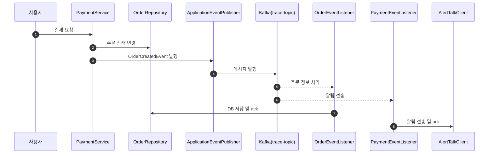
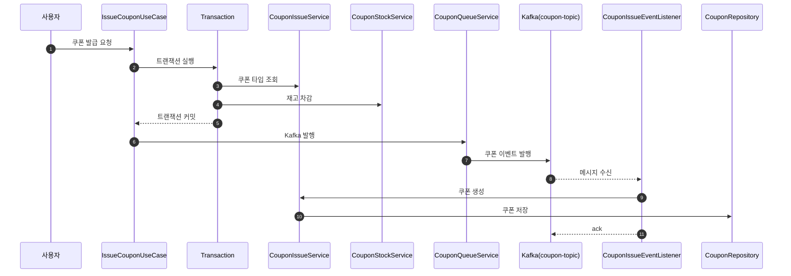

## Kafka 기반 결제 및 쿠폰 발급 시스템 설계 문서

### 1. 개요

본 설계는 실시간 주문/예약 정보 발행과 쿠폰 발급 대기열 처리를 위한 Kafka 아키텍처를 정리한 문서입니다. 주요 목표:

주문/예약 발생 시 메시지 비동기 발행
쿠폰 발급 요청 큐 처리 및 멱등성 보장
Producer/Consumer 예외 처리 및 DLQ 활용
---
### 2. 설계 원칙

1. **도메인 이벤트와 Kafka 메시지 분리**

    * 도메인 로직과 메시지 발행 책임 분리 (`OrderCreatedEvent`, `CouponIssueEvent`)

2. **비동기 메시지 처리**

    * Producer → Kafka Topic (비동기)
    * Consumer 처리 시 **멱등성 보장**
    * 실패 메시지는 DLQ 또는 Outbox 테이블로 이동

3. **예외 처리 및 재시도**

    * Producer: 메시지 전송 실패 → DLQ 토픽 전송
    * Consumer: 처리 실패 → 재시도 후 DLQ 전송

4. **트레이드오프**

    * 비동기 + 멱등 Consumer = 성능과 정확성 균형
    * Consumer가 메시지를 놓치더라도 Kafka 브로커에서 안전하게 보관됨
--- 

### 3. Kafka 설정 요약

```yaml
kafka:
  bootstrap-servers: localhost:9092,localhost:9094,localhost:9096
  producer:
    acks: all
    key-serializer: LongSerializer
    value-serializer: JsonSerializer
    properties:
      enable.idempotence: true
      min.insync.replicas=2
      retries: 3
  consumer:
    auto-offset-reset: earliest
    enable-auto-commit: false
    group-id: default-group
    key-deserializer: StringDeserializer
    value-deserializer: JsonDeserializer
    properties:
      spring.json.trusted.packages: "*"
      fetch.min.bytes: 50000
      fetch.max.bytes: 52428800
      max.poll.records: 1000
  listener:
    ack-mode: manual
    concurrency: 3
```

* **replicas**: 메시지 안정성을 위해 3개의 브로커에 복제
* **acks=all & min.insync.replicas=2**: 모든 ISR에 메시지가 기록되어야 전송 성공 처리
* **idempotence**: 중복 메시지 방지
* **listener concurrency**: 병렬 소비자 3개

---

### 4. Kafka 토픽 설계

```java
@Bean
public NewTopic orderPaymentTopic() { ... } // trace-topic
@Bean
public NewTopic couponIssueTopic() { ... } // coupon-topic
@Bean
public NewTopic dlqTopic() { ... } // DLQ-topic
```

* **partitions=3**: 병렬 처리와 성능 향상
* **replicas=3**: 장애 대비 데이터 복제
* **DLQ-topic**: 처리 실패 시 메시지 저장

---

### 5. 결제 이벤트 시퀀스 다이어그램



* **OrderEventListener**: 주문 정보 DB 저장
* **PaymentEventListener**: 사용자 결제 알림 전송
* **DLQ 처리**: 예외 발생 시 DLQ로 메시지 이동

---

### 6. 쿠폰 발급 이벤트 시퀀스 다이어그램



* **Distributed Lock**: 쿠폰 단위 동시 발급 방지
* **TransactionSynchronizationManager.afterCommit**: 트랜잭션 커밋 후 Kafka 발행
* **중복 처리**: DataIntegrityViolationException 발생 시 무시

---

### 7. 멱등 처리 흐름
* Kafka Producer: `enable.idempotence=true` → 브로커 중복 메시지 방지
* Consumer: DB 유니크 제약 + 예외 처리 → 중복 발급 방지
* DLQ: Producer/Consumer 실패 시 재처리
  ```java
     DefaultErrorHandler errorHandler = new DefaultErrorHandler(
                new DeadLetterPublishingRecoverer(kafkaTemplate),
                new FixedBackOff(1000L, 3) // 재시도 3회
        ); ```


### 8. 설계 요약

1. **Kafka를 통한 비동기 처리**: 결제, 주문, 쿠폰 발급
2. **멀티 파티션 & 레플리카**: 장애 대비 및 처리량 향상
3. **DLQ와 멱등성**: 안정적인 메시지 처리
4. **트랜잭션 + Distributed Lock**: 데이터 일관성 보장
5. **Listener concurrency**: 병렬 처리 성능 확보

---

