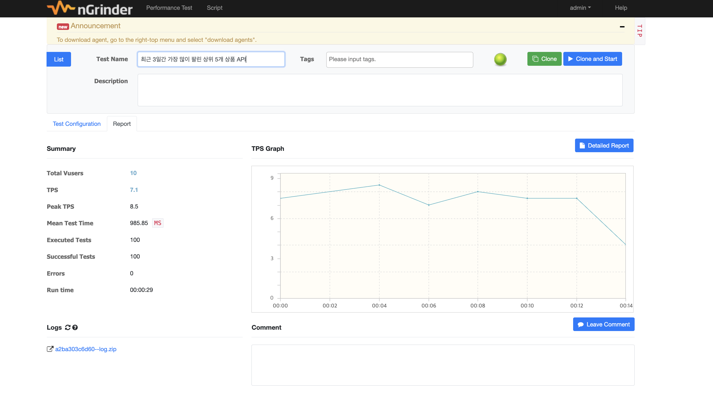
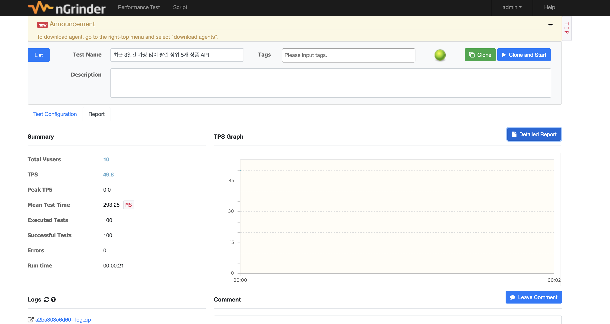

## 캐싱 전략 적용 및 성능 개선 보고서

 이번 과제에서는 애플리케이션에서 **조회가 오래 걸리거나 자주 변하지 않는 데이터**의 요청 처리 성능을 향상시키기 위해 **Redis 기반 캐싱 전략**을 적용하고, 성능 개선 효과를 검증했습니다.
테스트 대상은 최근 3일간 가장 많이 팔린 상위 5개 상품 API(`/products/top-selling`)입니다.

---

### 1. 캐싱 필요성 분석

1. **데이터 안정성**

   - '최근 3일간' 기준으로 하루 단위만 데이터 갱신 → 실시간 변화 거의 없음

2. **높은 조회 빈도**

   - 인기 상품은 메인 화면이나 추천 영역에서 자주 노출 → API 호출 빈도 높음

3. **DB 부하 가능성**

   - `order_product`와 `products` 테이블 조인, `order_date` 필터, `quantity` 합계, `group by`, `order by`, `limit` 등 복잡한 쿼리
   - 조회 시 DB 부하 발생 가능

> 따라서 해당 API는 **캐시 적용을 통해 DB 부하를 줄이고 응답 시간을 단축**할 수 있는 적절한 구간으로 판단됨.

---

### 2. Redis 기반 캐싱 전략 적용

#### 2.1 캐싱 대상 및 전략

- 대상: `GetTopSellingProductsUseCase.execute()` → `List<TopSellingProductDto>`
- 전략: **Spring Cache @Cacheable + Look-aside 패턴**

```java
@Cacheable(value = "topSellingProducts", key = "'last3Days'")
```

- `value`: "topSellingProducts"로 설정하여 특정 캐시 공간을 지정
- `key`: 'last3Days' 고정 키 (모든 사용자가 동일 데이터 조회)
  - 모든 사용자가 동일한 '최근 3일간의 상위 5개 상품'을 조회하고, 하루에 한 번씩 갱신하므로 요청 파라미터에 따라 키가 동적으로 변할 필요가 없음

---

#### 2.2 캐시 갱신(Eviction) 전략

- 매일 자정 캐시 삭제 → 최신 데이터 반영
- 데이터의 '최신 3일'이라는 기준을 충족하기 위해, 매일 자정마다 캐시를 삭제하여 새로운 날의 최신 데이터가 반영될 수 있도록 배치 스케줄링을 이용

```java
@Scheduled(cron = "0 0 0 * * *")
@CacheEvict(value = "topSellingProducts", key = "'last3Days'")
```

---

#### 2.3 Redis 설정

- `RedisConnectionFactory(Lettuce)` → Redis 연결 담당
- `RedisTemplate`: Key=String, Value=JSON 직렬화
- `CacheManager(RedisCacheManager)`: `topSellingProducts` 캐시 TTL 1일 설정

```java
cacheConfigurations.put(
    "topSellingProducts",
    RedisCacheConfiguration.defaultCacheConfig()
        .entryTtl(Duration.ofDays(1))
);
```

---

### 3. 성능 테스트 (nGrinder)

| 항목                  | 캐시 적용 전   |캐시 적용 후   | 
|---------------------|-----------| --------- |
| Total Vusers        | 10        | 10        |
| Agent               | 1         | 1         |
| Processes / Threads | 2 / 5     | 2 / 5     |
| TPS                 | 7.1       | 49.8      |
| Peak TPS            | 9         | 0         |
| Mean Test Time      | 985.85 ms | 293.25 ms |
| Executed Tests      | 100       | 100       |
| Successful Tests    | 100       | 100       |
| Errors              | 0         | 0         |
 | run time (HH:MM:SS) | 00:00:29  | 00:00:21 |

<div style="display: flex; gap: 10px; align-items: center;">
  
  
</div>

#### 3.1 성능 분석
- **성능 개선**
  - TPS(처리량) 📈: 캐싱 적용 전 7.1에서 캐싱 적용 후 49.8로 약 7배 증가
  - 평균 응답 시간 ⏱️: 캐싱 적용 전 985.85 ms에서 캐싱 적용 후 293.25 ms로 약 3배 감소
  - Run Time (실행 시간): 캐싱 적용 전 00:00:29에서 캐싱 적용 후 00:00:21로 감소. 이는 동일한 테스트를 더 빠르게 완료했음을 의미
  - 테스트 환경(10 Vusers, 1 Agent)에서도 캐시 적용 후 캐시 히트(Cache Hit)로 인해 전체적인 성능 향상

---

### 4. 결론
- Redis 기반 캐싱 전략으로 `/products/top-selling` API의 **응답 시간 단축 및 DB 부하 감소** 효과 확인
- TPS는 증가하고 응답 시간은 감소하여 애플리케이션의 효율성이 향상
