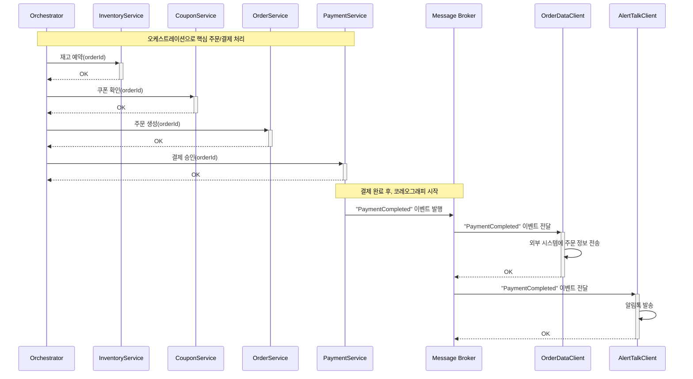
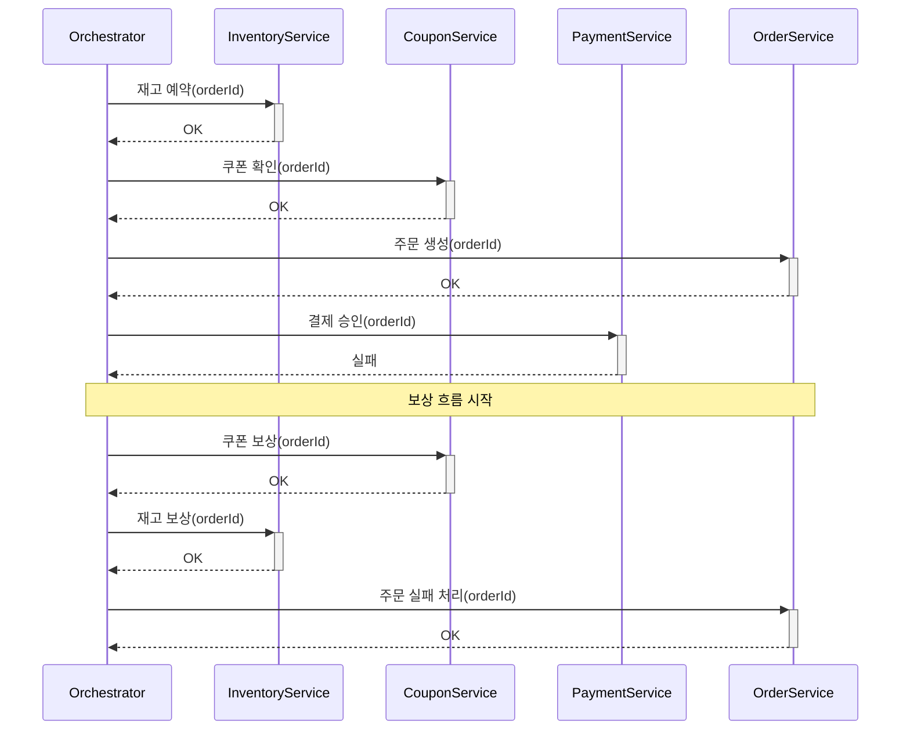

## 서비스 도메인 분리 시 트랜잭션 처리 설계 문서

도메인별 **애플리케이션 서버/DB 분리** 시 발생하는 트랜잭션 한계를 파악하고 **대응 방안**을 도출

---

### 1. 범위 & 가정

#### 1.1 초기 상태 (Monolithic): 현재 로직의 아키텍처
- **단일 DB** 기반 모놀리식 구조
- 트랜잭션
  - transactionTemplate.execute()를 통해 전체 비즈니스 로직을 하나의 로컬 ACID 트랜잭션으로 실행(강한 일관성)
  - 중간에 어떤 서비스(`ProductStockService`, `OrderService`, `PaymentService`)에서 오류가 발생하더라도 데이터베이스가 자동으로 모든 변경 사항을 롤백(rollback)
- 잠금(Locking): 
  - `Redisson`의 `RedissonMultiLock`을 사용하여 여러 상품, 쿠폰, 사용자 잔액에 대한 분산 잠금을 획득
  - 여러 애플리케이션 인스턴스가 동시에 주문을 처리할 때 발생하는 경합 조건(race condition)을 방지
- 장점: 강한 일관성, 단일 트랜잭션 처리 용이
- 문제점: 트랜잭션 경계가 넓어짐, 전체 롤백 부담
    - 트랜잭션 크기 큼 → 커넥션 많이 사용
    - 일부 코드 실패 시 전체 롤백 필요
    - 확장성 제약

#### 1.2 도메인별 애플리케이션 서버/DB 분리
- **도메인별 서비스**: 주문 / 결제 / 재고 / 쿠폰을 각각 독립적인 마이크로서비스로 분리, 도메인별 DB 물리 분리
- 장점: 도메인별 트랜잭션 경계 명확, 독립 처리 가능
- 단점:
    - 분산 트랜잭션 필요 → 트랜잭션 관리, 보상 로직 복잡
    - 실패 시 보상 로직 필요
    - 정합성 유지 어려움
    - 각 서비스가 독립 DB를 갖고 있어 **단일 ACID 트랜잭션 불가**

---

### 2. **애플리케이션 서버/DB 분리** 시 발생하는 트랜잭션 한계
- **강한 일관성 손실**: 단일 DB 트랜잭션 불가
- **부분 실패 문제**: 일부 단계 성공, 다른 단계 실패 시 정합성/중복/유실 위험
- **성능 저하/락 문제**: 분산 락 비용 큼, 최소화 필요

---

### 3. 대안 비교 및 대응 방안

| 대안 | 개념 | 장점 | 단점 |
|------|------|------|------|
| **오케스트레이션 Saga** | 중앙 오케스트레이터가 단계 호출/보상 관리 | 흐름/보상 가시성, 디버그 용이, 순서/타임아웃/재시도 중앙 제어 | 오케스트레이터 의존, 단일 장애/병목, 코드 집중 |
| **코레오그래피 Saga** | 이벤트 기반 다음 단계 트리거, 서비스가 보상 이벤트 구독 | 느슨한 결합, 확장성 좋음, 오케스트레이터 불필요 | 흐름 분산 → 관측성/디버깅 어려움, 사이클/중복 처리 주의 |
| **Outbox + 트랜잭셔널 메시징** | 로컬 DB 트랜잭션 내 상태 변경 + outbox 레코드 → 별 워커가 브로커로 전달 | 로컬 일관성 확보, 메시지 유실 방지, 재처리 가능 | Outbox 테이블 관리/청소 필요, 워커 운영 필요 |

- 대응 방안: **Outbox + Saga(오케스트레이션)**
- 잠금 전략: 각 서비스의 로컬 트랜잭션 내에서 짧은 락을 사용하고, Saga 패턴으로 전체 일관성 관리

---

### 4. 상세 설계

#### 4.1 트랜잭션 경계 & 보상

| 서비스 | 로컬 트랜잭션 | 보상 트랜잭션 |
|--------|----------------|----------------|
| **Order** | **주문 ID 생성** 및 `PENDING` 상태 기록, 이후 `PAID` 등 상태 업데이트 | `FAILED` 상태로 변경 |
| **Inventory** | 재고 차감, `reservationId` 기록 | 재고 복구 (idempotent) |
| **Coupon** | 상태 `USED`, 사용 로그 기록 | 상태 `AVAILABLE` 복구 |
| **Payment** | 승인 레코드/잔액 차감 | 환불/잔액 복구 |

- **주문 ID 생성**
  - 오케스트레이터가 Saga를 시작하기 전에 **Order 서비스**에 요청하여 **유일한 주문 ID**를 먼저 생성, `PENDING` 상태로 저장
  - 이 ID를 이후의 모든 단계에서 **멱등성(idempotency) 키**로 사용

#### 4.2 오케스트레이터 예시
- 상태 머신: `PENDING → RESERVED → COUPON_VALIDATED → PAID → COMPLETED`
- 단계별 시맨틱:
  - **시작**: 오케스트레이터가 `Order` 서비스에 `createOrder` 요청, 응답으로 **주문 ID**를 받음.
  - **재고/쿠폰**: `Inventory`, `Coupon` 서비스 호출 시 **주문 ID**를 함께 전달.
  - **결제**: 외부 호출 → Circuit Breaker / Timeout / Bulkhead
- 실패 시 보상 트랜잭션 실행

#### 4.3 멱등성 & 중복 방지
- 서비스별 **IdempotencyKey**: `(orderId, step)` 조합으로 유니크 인덱스 설정
- 동일 요청이 중복으로 들어와도 **한 번만 처리되도록 멱등성 보장**
- 보상 트랜잭션도 동일 키 기반으로 **중복 실행 방지 및 상태 복구**

---

### 5. 시퀀스 예시

#### 5.1 성공 플로우

#### 5.2 결제 실패 플로우

---

### 6. 최종 방안
- **Outbox + 오케스트레이션 Saga** 적용  
  - 주문, 재고, 결제와 같이 강한 일관성이 중요하고, 실패 시 보상(Compensation) 로직이 필수적인 핵심 플로우는 중앙에서 관리하여 일관성 확보
- 외부 데이터 연동, 알림톡 전송을 **코레오그래피 Saga**로 적용
- 원칙:
    - 로컬 ACID, 글로벌 최종 일관성
    - 짧은 락, 빠른 실패
    - 멱등 우선 처리

  
