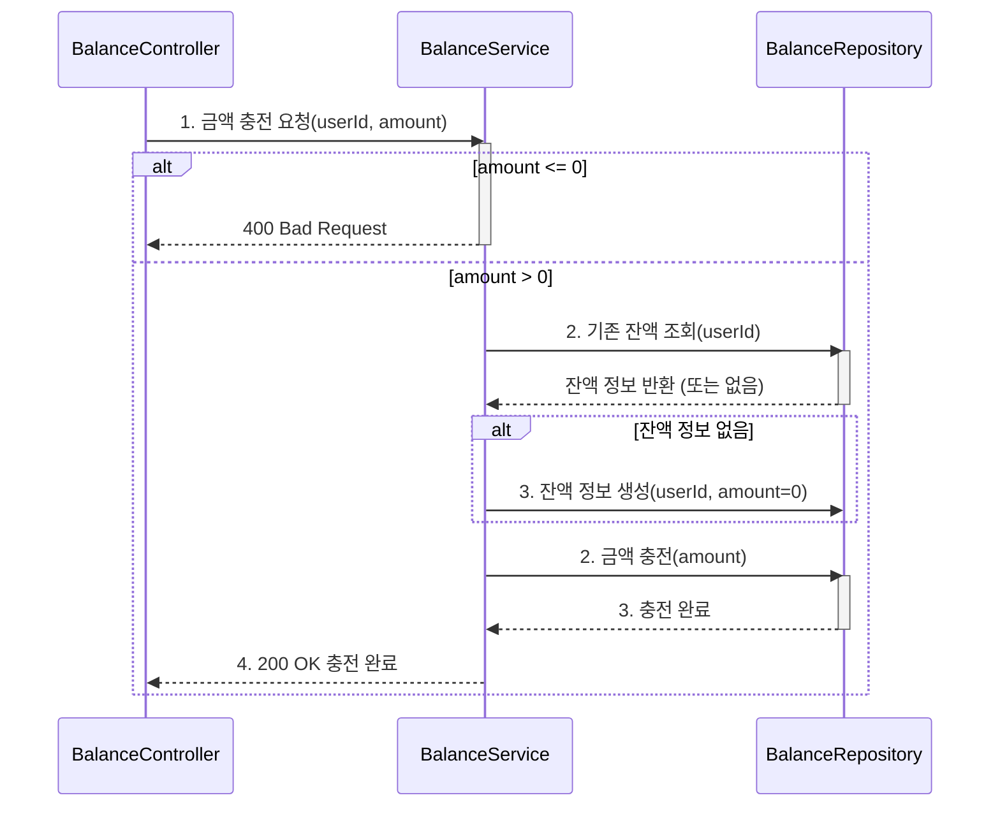

### 잔액 충전

```mermaid
sequenceDiagram
    participant BalanceController
    participant BalanceService
    participant BalanceRepository

    BalanceController->>BalanceService: 1. 금액 충전 요청(userId, amount)
  activate BalanceService
    
       alt amount <= 0
        BalanceService-->>BalanceController: 400 Bad Request
        deactivate BalanceService
   else amount > 0
        BalanceService->>BalanceRepository: 2. 기존 잔액 조회(userId)
        activate BalanceRepository
				BalanceRepository-->>BalanceService: 잔액 정보 반환 (또는 없음)
				deactivate BalanceRepository
				
        alt 잔액 정보 없음
            BalanceService->>BalanceRepository: 3. 잔액 정보 생성(userId, amount=0)
        end
	  
    BalanceService->>BalanceRepository: 2. 금액 충전(amount)
    activate BalanceRepository
    BalanceRepository-->>BalanceService: 3. 충전 완료
    deactivate BalanceRepository
    
    BalanceService-->>BalanceController: 4. 200 OK 충전 완료
     end


```