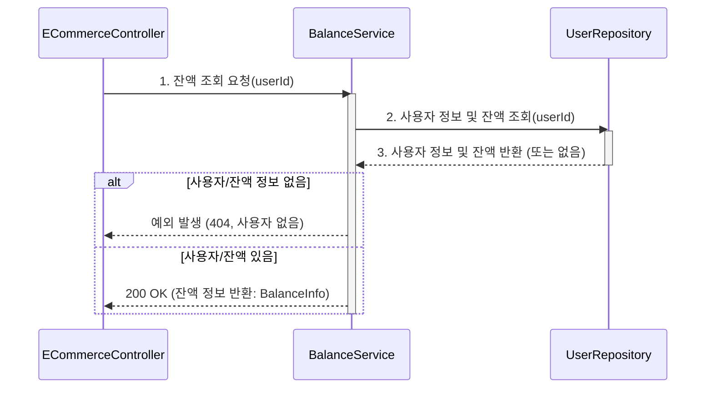

### 잔액 조회

```mermaid
sequenceDiagram
    participant BalanceController as ECommerceController
    participant BalanceService
    participant UserRepository

    BalanceController->>BalanceService: 1. 잔액 조회 요청(userId)
    activate BalanceService

        BalanceService->>UserRepository: 2. 사용자 정보 및 잔액 조회(userId)
        activate UserRepository
        UserRepository-->>BalanceService: 3. 사용자 정보 및 잔액 반환 (또는 없음)
        deactivate UserRepository
        
        alt 사용자/잔액 정보 없음
            BalanceService-->>BalanceController: 예외 발생 (404, 사용자 없음)
        else 사용자/잔액 있음
            BalanceService-->>BalanceController: 200 OK (잔액 정보 반환: BalanceInfo)
        end
    deactivate BalanceService

```