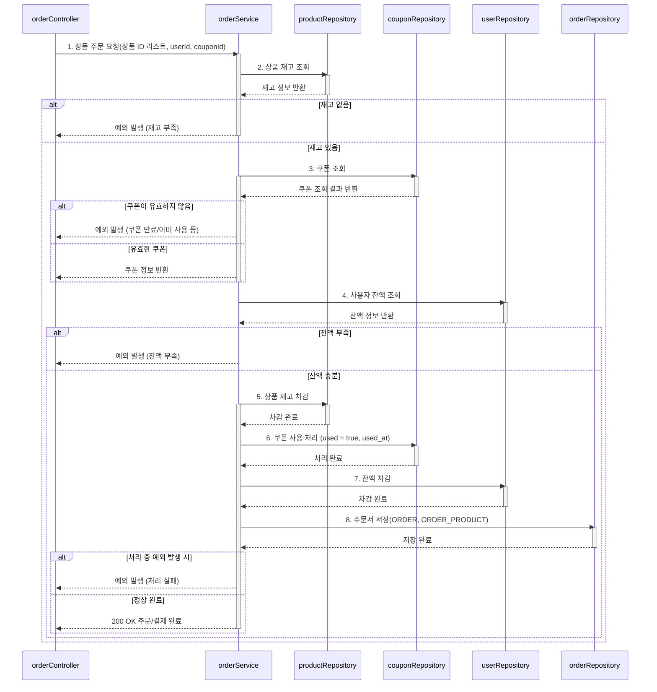

### 주문 결제

```mermaid
sequenceDiagram
    participant orderController
    participant orderService
    participant productRepository
    participant couponRepository
    participant userRepository
    participant orderRepository

orderController->>orderService: 1. 상품 주문 요청(상품 ID 리스트, userId, couponId)
activate orderService
orderService->>productRepository: 2. 상품 재고 조회
activate productRepository
 productRepository-->>orderService: 재고 정보 반환
    deactivate productRepository
alt 재고 없음
    orderService-->>orderController: 예외 발생 (재고 부족)
     deactivate orderService
else 재고 있음
    orderService->>couponRepository: 3. 쿠폰 조회
        activate orderService
        activate couponRepository
    couponRepository -->> orderService : 쿠폰 조회 결과 반환
        deactivate couponRepository

       alt 쿠폰이 유효하지 않음
    orderService -->> orderController : 예외 발생 (쿠폰 만료/이미 사용 등)

    else 유효한 쿠폰
        orderService-->>orderController: 쿠폰 정보 반환
        end
        deactivate orderService
    orderService->>userRepository: 4. 사용자 잔액 조회
       activate userRepository
       userRepository-->>orderService: 잔액 정보 반환
        deactivate userRepository

    alt 잔액 부족
        orderService-->>orderController: 예외 발생 (잔액 부족)
    else 잔액 충분
     %% 트랜잭션 시작
        orderService->>productRepository: 5. 상품 재고 차감
         activate orderService
        activate productRepository
        productRepository-->>orderService: 차감 완료
        deactivate productRepository
        	orderService->>couponRepository: 6. 쿠폰 사용 처리 (used = true, used_at)
         activate couponRepository
         couponRepository-->>orderService: 처리 완료
          deactivate couponRepository      
        orderService->>userRepository: 7. 잔액 차감
        activate userRepository
        userRepository-->>orderService: 차감 완료
				deactivate userRepository
			
         orderService->>orderRepository: 8. 주문서 저장(ORDER, ORDER_PRODUCT)
          activate orderRepository
          orderRepository-->>orderService: 저장 완료
          deactivate orderRepository 
          
            alt 처리 중 예외 발생 시
                orderService-->>orderController: 예외 발생 (처리 실패)
            else 정상 완료
                orderService-->>orderController: 200 OK 주문/결제 완료
		          deactivate orderService
        end
    end
end

```